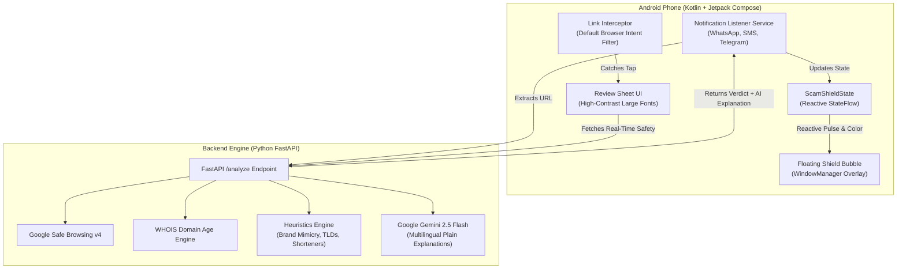

# 🛡️ ScamShield
> **A Floating Scam-Link Guardian for Elderly Smartphone Users**  
> *Built for Tata Young Social Innovator Challenge 2026*

[](scamshield-android)
[](scamshield-backend)
[](scamshield-backend)
[](scamshield-backend)

---

## 📖 Overview

**ScamShield** is an Android security guardian designed specifically for senior citizens and non-technical smartphone users. It requires **zero effort** from the user—operating automatically in real-time across WhatsApp, SMS, Telegram, and mobile browsers.

### 🌟 Two Moments of Defense
1. **Moment 1 (When message arrives):** Silently inspects notifications. When a URL is found, a small floating bubble on screen glows **Green (Safe)**, **Amber (Suspicious)**, or **Red (Scam Alert)**.
2. **Moment 2 (When link is tapped):** Intercepts the browser intent before opening and displays a high-contrast, large-font **Review Sheet** with a plain-language AI explanation generated by **Google Gemini** (e.g., *"This link looks like your bank's but it's a fake trying to steal your password"*), a prominent **"← Go Back"** button, and a **"👨‍👩‍👧 Ask My Family"** second-opinion button.

---

## 🏗️ Architecture



---

## 📁 Repository Structure

```
├── scamshield-android/         # Kotlin + Jetpack Compose Android Application
│   ├── app/src/main/
│   │   ├── java/com/scamshield/app/
│   │   │   ├── MainActivity.kt               # Main Dashboard
│   │   │   ├── ScamShieldState.kt            # Reactive State Singleton
│   │   │   ├── overlay/                      # Floating Bubble Overlay
│   │   │   │   ├── BubbleOverlayService.kt
│   │   │   │   └── BubbleView.kt
│   │   │   ├── listener/                     # WhatsApp/SMS Notification Scanner
│   │   │   │   ├── ScamShieldNotificationListener.kt
│   │   │   │   └── UrlExtractor.kt
│   │   │   ├── intercept/                    # Link Interception & Review UI
│   │   │   │   ├── LinkInterceptActivity.kt
│   │   │   │   └── ReviewSheetScreen.kt
│   │   │   ├── family/                       # Family Safety Net Sharing
│   │   │   │   └── FamilyShareHelper.kt
│   │   │   └── api/                          # Retrofit API Client
│   │   └── AndroidManifest.xml
│   └── build.gradle.kts
│
├── scamshield-backend/         # FastAPI URL Analysis & AI Explanation Engine
│   ├── analyzers/
│   │   ├── safe_browsing.py    # Google Safe Browsing API v4
│   │   ├── domain_checker.py   # Domain Age & WHOIS Analysis
│   │   ├── heuristics.py       # Pattern Matching & Risk Scoring
│   │   └── gemini_explainer.py # Google Gemini 2.5 Flash Explainer
│   ├── main.py                 # FastAPI Application & Endpoints
│   ├── models.py               # Pydantic Request/Response Models
│   ├── requirements.txt
│   └── vercel.json             # Vercel Deployment Configuration
│
└── submission_document.md      # Full Competition Submission & Impact Report
```

---

## 🚀 Getting Started

### 1. Backend Setup
```bash
cd scamshield-backend
pip install -r requirements.txt
python -m uvicorn main:app --host 0.0.0.0 --port 8000
```

### 2. Android App Setup
1. Open `scamshield-android` in **Android Studio**.
2. Connect your Android phone via USB (with USB Debugging enabled).
3. Click **Run ▶** (`Shift + F10`).

---

## 🔒 Privacy-First Design
- Only the specific URL is sent to the backend for threat analysis.
- **No message text, personal chats, contacts, or user identifiers are ever stored or transmitted.**
- Zero tracking or telemetry.
